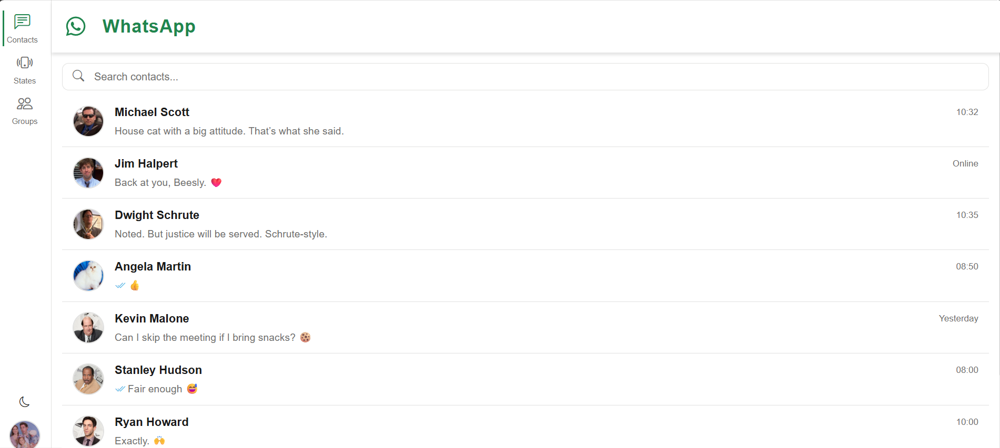
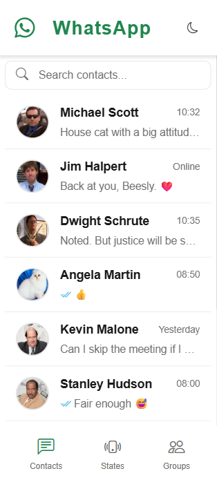

### 📱 WhatsApp Clone - React

## 🚀 Descripción del Proyecto

Una aplicación desarrollada en React para enviar mensajes, diseñada como un clon de WhatsApp. Desarrollada como parte del Diplomado en Desarrollo Web Fullstack (curso de Frontend).

Esta aplicación permite:
- Ver tu lista de contactos  
- Enviar mensajes en el chat de cada contacto  
- Eliminar mensajes  
- Ver detalles del contacto  
- Buscar chats de contactos
- Cambiar entre Light y Dark Mode 

## ✅ Requisitos del Trabajo Final

- ✅ Despliegue en Vercel (u otro hosting a elección) funcional  
- ✅ Código subido a GitHub  
- ✅ Readme.md con una descripción del desafío elegido, librerías utilizadas y dificultades encontradas durante la resolución  
- ✅ Responsivo desde 320px hasta 2000px  
- ✅ Estilos accesibles siguiendo buenas prácticas vistas en clase (por ejemplo, fondos claros con texto claro se consideran inaccesibles)  
- ✅ Desarrollado en React  
- ✅ Implementación de gestión de estados  
- ✅ Uso de Contexts (opcional)  
- ✅ Enrutamiento implementado con react-router-dom  
- ✅ Debe incluir al menos 1 formulario  
- ✅ Debe utilizar componentes  
- ✅ Debe tener al menos 2 páginas en el flujo de la aplicación, con al menos una utilizando parámetros de búsqueda en la URL (a través de react-router-dom)  
- ✅ Se valorará la calidad del código siguiendo los principios de programación vistos en clase (DRY, YAGNI, KISS)  
- ✅ Se pueden usar diseños o páginas preexistentes como referencia para enfocarse menos en aspectos estéticos  

## 🛠️ Tecnologías y Librerías Utilizadas

- React  
- React Router  
- Context API para gestión de estado global  
- Vite  
- JavaScript (ES6+)  
- SASS: uso de variables, mixins, anidamiento y otras funcionalidades  
- Bootstrap Icons  
- Framer-motion para animaciones  

## 📸 Capturas de Pantalla

## 💡 Feedback sobre la Clase de Desarrollo Web

Antes que nada, muchas gracias por la buena onda y predisposición al explicar los contenidos durante el curso. Desde mi experiencia personal, yo ingresé con una base sólida en HTML y CSS, y mi objetivo principal era enfocarme en aprender JavaScript y React. Esta última parte fue la que más me costó y a la que más le dedique tiempo de práctica. Quizás me hubiera gustado que se llegaran a abordar otros contenidos que se promocionaban en el temario del curso como css advanced, boostrap y redux. Un saludo y espero poder seguir en contacto en este maravilloso mundo del coding 👍🤓
